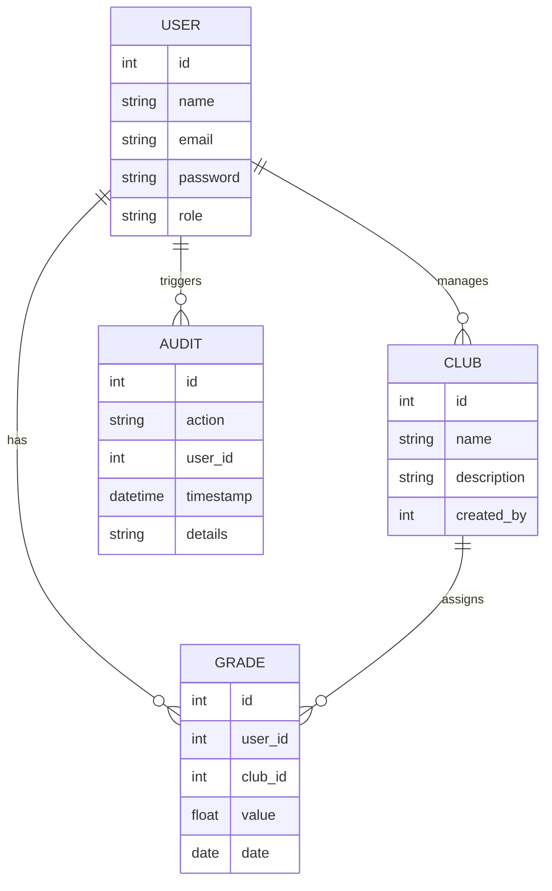

# ClubSCM — Comprehensive System Documentation

## 1. Overview
ClubSCM is a comprehensive Student Club Management System designed to streamline the administration of student clubs, user roles, grade tracking, and analytics. It provides a modern, user-friendly interface for both administrators and users, supporting secure authentication, robust data management, and insightful dashboards.

---

## 2. System Architecture

- **Frontend:** React (Vite, Tailwind CSS)
- **Backend:** Node.js, Express
- **Database:** Relational SQL (schema and seed scripts provided)
- **Communication:** RESTful API (JSON over HTTP)

### High-Level Data Flow
```mermaid
graph TD
    User[User (Browser)] -- HTTP/JSON --> Frontend[React App]
    Frontend -- API Calls --> Backend[Express Server]
    Backend -- SQL Queries --> Database[(SQL Database)]
    Backend -- File Uploads --> Uploads[Uploads Folder]
    Backend -- Audit Logs --> Audit[Audit Log]
```

---

## 3. Entity-Relationship (ER) Diagram & Entities

### Main Entities
- **User**: id, name, email, password, role, etc.
- **Club**: id, name, description, created_by, etc.
- **Grade**: id, user_id, club_id, value, date, etc.
- **Audit**: id, action, user_id, timestamp, details

### ER Diagram


---

## 4. Data Flow & Integration

- **Frontend** communicates with **Backend** via RESTful API endpoints (see `backend/src/routes/`).
- **Backend** handles authentication, validation, business logic, and database operations.
- **Database** stores persistent data (users, clubs, grades, audit logs).
- **Uploads** folder stores any uploaded files (if applicable).
- **Audit** logs are maintained for key actions (see `backend/src/utils/audit.js`).

---

## 5. Database Details
- Schema defined in `database/schema.sql`
- Seed data in `database/seed.sql`
- Uses foreign keys for relationships
- Example tables: users, clubs, grades, audit

---

## 6. API Endpoints (Backend)
- `/api/auth` — Authentication (login, register)
- `/api/users` — User management
- `/api/clubs` — Club management
- `/api/grades` — Grade management
- `/api/dashboard` — Dashboard analytics
- `/api/meta` — Metadata

---

## 7. Frontend Pages & Components
- **Pages:** Dashboard, EntryForm, EntryList, Login, Profile, Users
- **Components:** Navbar, UI elements (Button, Card, Input, Modal, Select, Toast)
- **Context:** AuthContext for authentication state
- **i18n:** Internationalization support

---

## 8. Authentication & Security
- JWT-based authentication (see `backend/src/middleware/auth.js`)
- Input validation (see `backend/src/middleware/validate.js`)
- Role-based access control
- Passwords hashed before storage

---

## 9. Deployment & Configuration
- **Frontend:** Vercel, Netlify, or any static host
- **Backend:** Node.js server (can be deployed to Heroku, Render, etc.)
- **Database:** Any SQL-compatible host (local or cloud)
- **Configuration:** Environment variables for secrets, DB connection, etc.

---

## 10. Development & Contribution
- Clone the repo
- Set up database using provided SQL scripts
- Install dependencies in both `frontend/` and `backend/`
- Run backend and frontend servers
- PRs and issues welcome!

---

## 11. Additional Notes
- Audit logging for traceability
- Modular code structure for scalability
- Responsive UI for all devices
- Internationalization ready

---

## 12. License
See [LICENSE](LICENSE) for details.
